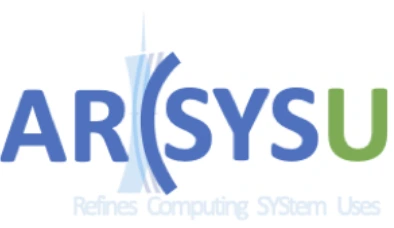

<h1 align="center">𝙃𝙚𝙡𝙡𝙤, 𝙄'𝙢 Fernandez Owen</h1>
<h3 align="center">A passionate CS student from China</h3>

  
  

  

  
  

💡 𝑷𝒂𝒔𝒔𝒊𝒐𝒏𝒂𝒕𝒆 𝒂𝒃𝒐𝒖𝒕 𝒃𝒓𝒊𝒏𝒈𝒊𝒏𝒈 𝒊𝒅𝒆𝒂𝒔 𝒕𝒐 𝒍𝒊𝒇𝒆. 𝑬𝒙𝒑𝒍𝒐𝒓𝒆 𝒂𝒍𝒍 𝒐𝒇 𝒎𝒚 𝒑𝒓𝒐𝒋𝒆𝒄𝒕𝒔.

## >个人信息 Personal Information

- **姓名**：欧阳易芃 Yipeng OUYANG
- **性别**：男 Male
- **国籍**：中国 China
- **邮箱**：ouyyp5@mail2.sysu.edu.cn

## >个人经历 Personal Experience

教育经历：
- **2020.09-2023.07**  _广州市第二中学 GZEZ_ 高中
- **2021.06-2022.06**  [世界奥林匹克竞赛（地理）中国国家集训队](http://www.igeocn.com/igeocn/senior_school/20211129/huojiang%20xuesheng.pdf)
- **2023.09-至今**     _中山大学-计算机学院 SYSU-CSE_ 本科

学术经历：
- **2024.1-2024.7**  课程助教 [SYSU-DCS290/292: 编译原理与实验，Spring 2024](https://arcsysu.github.io/teach/dcs290/s2024.html)
- **2024.1-2025.7**  课程助教 [SYSU-DCS290/292: 编译原理与实验，Spring 2025](https://yatcc-ai.com/teach/s2025.html)
- **2023.10-至今**   [中山大学-ARCSYSU Lab](https://xianweiz.github.io/#pple)

专业学习：
- **专业**：计算机科学与技术 Computer Science and Engineering
- **综测排名**：
  - 6/~400, ~1.5%(2023-2024)
  - 10/~300, ~3.3%(2024-2025)

## >参与论文 Contributed Papers
- XFuse: PTX level Code Fusion for GPU Concurrent Kernel Execution, **TACO(CCF-A, submitting)**
  - K. Wu, **Y. Ouyang** et al.,
  - GoPTX 的扩展工作，增加多种调优参数与内核匹配策略，总体性能提升至 15.8%
    - GoPTX, K. Wu et al., **DAC'25(CCF-A)**
- YatCC-AI: LLM Augmented HPC Workbench Prototype for Practices and Researches, **CHI(CCF-A, submitting)**
  - K. Wu, H. Chen, Z. Zhu, Q. Lin, **Y. Ouyang** et al.,
- WARM: WebAssembly-based Multi-request Aggregation for Optimizing LLM Applications, **NeurIPS'25(CCF-A, submitting)**
  - Y. Han et al.,
  - 参与排版、图片布局（非作者）
- Towards Long-Horizon Vision-Language Navigation: Platform, Benchmark and Method, **CVPR'25(CCF-A)**
  - Xinshuai Song et al.,
  - 数据筛选，代码review（非作者）
- 3DAffordSplat: Efficient Affordance Reasoning with 3D Gaussians
  - Zeming Wei et al.,
  - 数据筛选、标注（非作者）

## >重要项目 Important Project
- **项目名称**：[YatCC-AI](https://yatcc-ai.com/)
  - **角色**：项目主要成员 课程助教
  - **工作内容**：AI/LLM部分构造 重要文档编写
  - **项目负责**：[Xianwei ZHANG](https://xianweiz.github.io/)
  - **工作成果**：
    - 全球首个全流程引入HPC+大语言模型源码优化的编译实验课程
    - **Top Grand Prize**, 2025 China Computer Education Conference (CCEC'25)
    - **First Prize**, 2024 China Computer Education Conference (CCEC'24)
    - 2025年广东省科技创新战略专项资金项目（applying）
    - **Best Poster Award** - Workshop of Data Sharing and Infrastructure 2024, December 18-20 国际级会议 第一名
    - 中山大学校级表彰课程，多次获[校级推文宣传（作为文章作者）](https://mp.weixin.qq.com/s/UiXcaOTAOure8YTmyMWJ8Q)
    - 中山大学2025年教学改革专项项目

## >荣誉和奖项 Awards

- **华为奖学金 HUAWEI Scholarship'24**
  - Awarded exclusively as the sole recipient in the CSE School
- 中山大学一等奖学金 First-Class Scholarship​'24
- 中山大学一等奖学金 First-Class Scholarship​'25
- ​​First-Class Ethical Leadership Scholarship​'25
- 中山大学程序设计-Novice Competition
  - Bronze'24
  - Silver'25
- Best Poster Award - Workshop of Data Sharing and Infrastructure(China,Japan,Korea) 2024, December 18-20 国际级会议 YatCC团队获奖
- 全国大学生数学竞赛 省级三等奖
- 中山大学W4terCTF网络安全赛 Excellence Award​​

## >其他项目 Other Project
- **项目名称**：基于强化学习的国产超算芯片编译器优化
  - **角色**：项目主要成员
  - **工作内容**：代码编写 参与比赛
  - **项目负责**：Haoquan CHEN
  - **项目级别**：省级大创项目 已结题
- **项目名称**：基于多智能体论辩式生成技术与思维链的新型编译：以国产大模型驱动 C 到 Rust 安全源码转换为例
  - **角色**：总负责人
  - **工作内容**：项目计划 主体实现
  - **项目级别**：省级大创项目
  - **项目负责**：[Yipeng OUYANG](https://ouyangyipeng.github.io/)
- **项目名称**：OYOS (Rust-based Operating System, x86-64)
  - **角色**：作者
  - **工作内容**：系统实现
  - **项目级别**：课程项目
- **项目名称**：基于AI大模型和超算平台的法律档信息全流程自动化识别分析器
  - **角色**：合作负责人
  - **工作内容**：项目计划 主体实现
  - **项目级别**：校级大创项目、校级挑战杯
  - **项目负责**：Xiangning Zheng
- **项目名称**：面向HUAWEI昇腾服务器（aarch64-openEuler）的编译器混合精度优化
  - **角色**：队长
  - **工作内容**：主要代码编写
  - **项目负责**：[Yipeng OUYANG](https://ouyangyipeng.github.io/)
  - **项目来源**：2024全国大学生系统竞赛-编译比赛
- **项目名称**：有关大语言模型交互与思维链封装对促进编译优化的探索：以LLM Compiler优化循环展开为例
  - **角色**：项目主要成员
  - **工作内容**：知识学习 方法探索 论文复现
  - **项目负责**：Gaojin SUN
- **项目名称**：[Yat-Search-Engine](https://github.com/ouyangyipeng/Yat-Search-Engine)
  - **角色**：唯一作者
  - **工作内容**：项目计划 主体实现
  - **项目负责**：[Yipeng OUYANG](https://ouyangyipeng.github.io/)
- **项目名称**：[Thinking-GPT4o](https://github.com/ouyangyipeng/Thinking-GPT4o)
  - **角色**：唯一作者
  - **工作内容**：项目计划 主体实现
  - **项目负责**：[Yipeng OUYANG](https://ouyangyipeng.github.io/)

## >职务 Title

- 中山大学计算机学院 学生会 主席/功能型支部书记
- 中山大学计算机学院 2023级5班 班长
- 世界奥林匹克竞赛 国家集训队（地理） 队员-2021/2022
- 中山大学书法社 干部
- 中山大学党委组织部 求进报社 新媒体部 次要负责人
- 广东省志愿者协会、禁毒委员会 二星志愿者

## >兴趣爱好 Hobby

- 软笔书法 (行-赵王 / 草-张 / 楷-褚)
- 高尔夫 网球 台球 羽毛球 足球
- 地质与矿晶 (地球科学 / 矿晶收藏)
- 摄影

### 相关奖项与一些其他奖项

- 2021届世界奥林匹克地理竞赛-中国赛区 金牌
- 2022届世界奥林匹克国家集训队内前20
- 第7届世界青少年书画大赛铜牌
- 中山大学计算机学院2025返乡实践摄影比赛 第一名
- 红十字会定向越野等比赛 校级第一
- 网络安全 100分
- 民族宗教知识竞赛 100分

## >自我介绍 Introduction

现就读于中山大学计算机本科2023级，属中山大学[ArcSysu](https://github.com/arcsysu)实验室（[张献伟](https://xianweiz.github.io/)教授）。合作于中山大学[HCPII](https://www.sysu-hcp.net/home/)实验室（[林倞](http://www.linliang.net/)教授，[刘阳](https://yangliu9208.github.io/)副教授）。

## >研究方向 Research Directions

- AI Integrated Compilers
- Embodied Intelligence

## > My GitHub Stats 📈

  

    
  

  

    
  

  

    
  

## > Currently Working On

  
  
  

## > My Tech Stack

  
  
  
  
  
  
  
  
  
  
  
  
  
  
  
  

  

**Currently working with:**

**Learning:**

  

    
  

  

    You are No. 
     to visit me!
  

